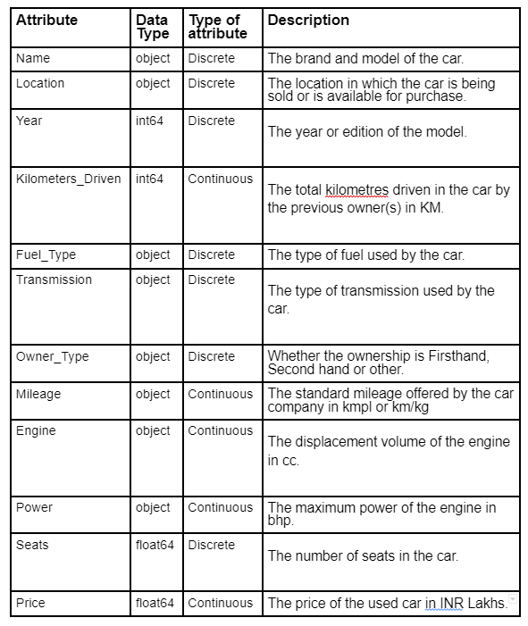
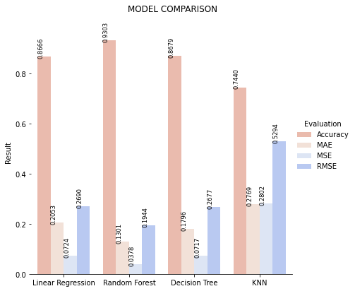

# Used-Car-Price-Prediction

The used automobile market is a growing business with a market value that
has nearly doubled itself in previous years. The rise of online websites and other
tools like it have made it easier for both buyers and sellers to get a better
understanding of the factors that determine the market value of a used car.
Based on a set of factors, Machine Learning algorithms may be used to forecast
the price of any automobile.

The main purpose of this study is to compare the accuracy of various
predictions for estimating a used car’s retail price in a manner to maximise the
accuracy of prediction. In this research I have used models like Linear
Regression, Decision Trees and Random Forest Regression and compared their
accuracies.

## DATASET

***Name*** : usedCarPrices  
***Source***: Kaggle  
***Shape*** : (6019,12)  
***Target variable***: Price  
***Link*** : [Used-car-price-prediction](https://www.kaggle.com/datasets/gothamv/usedcarprices)  

###### Attribute Details

## Comparing Performance of Models

After training the Model the outcome obtained on the Test data is as follows:

Random Forest has the highest accuracy among the four models (Linear Regression, Random Forest, Decision Tree and KNN) of 93.03%

